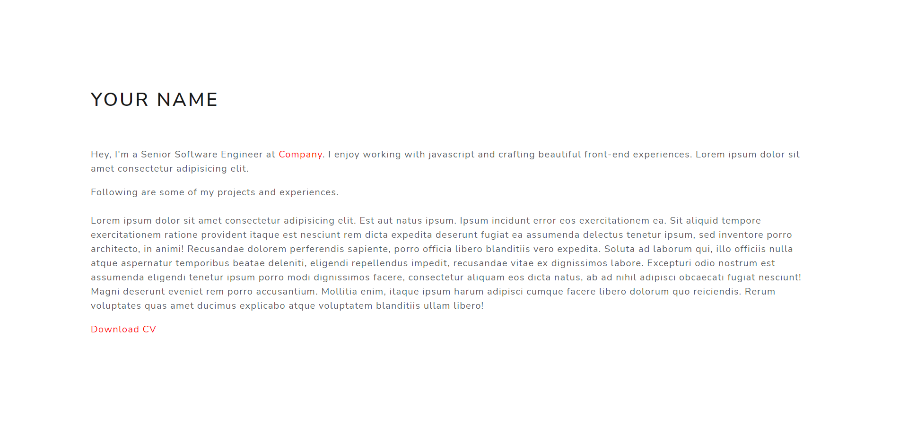

# Scriptag

Scriptag is a CLI `create-react-app` template generator for minimal portfolios. Just a single command in your terminal will generate all the code required to get started with your very own portfolio.

Visit the official website [here](https://scriptag.vercel.app/). 

<div class="text-center">Initial installation</div>


## Installation

```bash
$ npx create-react-app <project name> --template scriptag
$ cd <project name>
$ npm start
```

In case of `yarn` package manager: 
```bash
$ yarn create react-app <project name> --template scriptag
$ cd <project name>
$ yarn start
```

## Creating pages

You can generate `directories` by creating a screens/pages folder in the root directory. Components can also be created and the app can be simply extended in the same way we do in case of a CRA app. There are no constraint to possibilities.

--- 

You can edit the attributes according to html. The icon can be manually replaced as well. The styling (`style.css` in `/css`) can be manually changed according to need as can be changed the font (in `/build_scripts`).

The pages are generated in the `build` directory on root after you run `npm run build` which you can use to deploy your site.

## Dependencies

- react-dom
- bootstrap
- react-bootstrap
- sass

## Features
    Sharply single page web template
    Pre defined fonts 
    Dependencies pre installed
    Markdown support
    Blazing fast Next.js deployment

## License

[](https://github.com/sambhavsaxena/scriptag/blob/main/LICENSE)

<div align="center"><a href="https://www.npmjs.com/package/cra-template-scriptag" target="_blank">Visit here</a></div>

